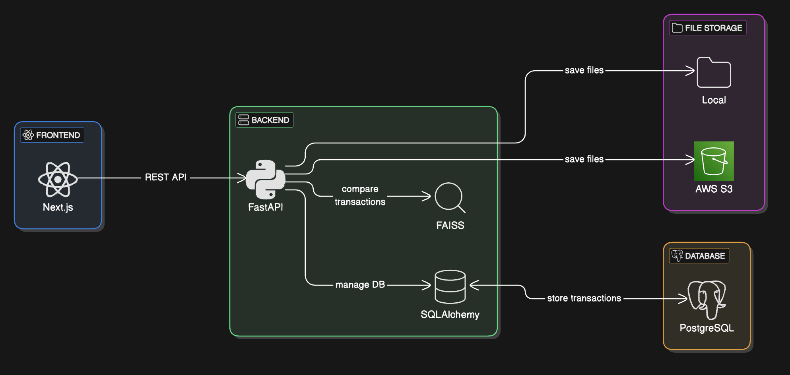

## Índice

0. [Ficha del proyecto](#0-ficha-del-proyecto)
1. [Descripción general del producto](#1-descripción-general-del-producto)
2. [Arquitectura del sistema](#2-arquitectura-del-sistema)
3. [Modelo de datos](#3-modelo-de-datos)
4. [Especificación de la API](#4-especificación-de-la-api)
5. [Historias de usuario](#5-historias-de-usuario)
6. [Tickets de trabajo](#6-tickets-de-trabajo)
7. [Pull requests](#7-pull-requests)

---

## 0. Ficha del proyecto

### **0.1. Tu nombre completo:**

Jorge Luis Sánchez Ocampo

### **0.2. Nombre del proyecto:**

Close AI

### **0.3. Descripción breve del proyecto:**

Close AI es un sistema basado en inteligencia artificial diseñado para analizar y comparar transacciones bancarias provenientes de archivos Excel. Su objetivo es identificar coincidencias entre registros, detectar discrepancias en montos y estados de transacción, y facilitar la revisión manual de posibles errores. Utiliza técnicas avanzadas de procesamiento de datos con Pandas, búsqueda de similitud con FAISS y generación de embeddings con SentenceTransformers. Close AI está diseñado para ser eficiente, escalable y fácilmente integrable mediante una API, permitiendo su uso en aplicaciones financieras y auditorías automatizadas.

### **0.4. URL del proyecto:**

https://closeai-blush.vercel.app/

### 0.5. URL o archivo comprimido del repositorio

https://github.com/IamJorx/AI4Devs-finalproject-JLSO.git

---

## 1. Descripción general del producto

Close AI es un sistema basado en inteligencia artificial diseñado para analizar y comparar transacciones bancarias provenientes de archivos Excel. Su objetivo es identificar coincidencias entre registros, detectar discrepancias en montos y estados de transacción, y facilitar la revisión manual de posibles errores.

El sistema utiliza técnicas avanzadas de procesamiento de datos con Pandas, búsqueda de similitud con FAISS, generación de embeddings con SentenceTransformers y una base de datos en PostgreSQL para almacenar y gestionar las transacciones de manera eficiente. Está compuesto por un backend desarrollado en FastAPI y un frontend en Next.js, ofreciendo una interfaz intuitiva para la carga de archivos.

### **1.1. Objetivo:**

Close AI está diseñado para ayudar a instituciones financieras, contadores, auditores y equipos de compliance en la detección de inconsistencias en transacciones bancarias. Su principal propósito es:

- Automatizar la comparación de registros financieros para reducir errores manuales.
- Identificar discrepancias entre archivos de diferentes fuentes (por ejemplo, conciliaciones bancarias).
- Optimizar el tiempo de auditoría proporcionando reportes claros y organizados.
- Ofrecer una solución escalable que pueda manejar grandes volúmenes de datos sin degradación del rendimiento.

### **1.2. Características y funcionalidades principales:**

🔹 Comparación de transacciones

- Identificación de coincidencias exactas y transacciones con discrepancias.
- Tolerancia a variaciones menores en montos y fechas.
- Detección de estados inconsistentes (ej. “Exitosa” vs “Fallida”).

📊 Análisis y Reportes

- Visualización de resultados en una interfaz intuitiva.
- Descarga de reportes detallados en formatos Excel/CSV.
- Búsqueda y filtrado avanzado de transacciones.

🗂️ Gestión de Archivos -

- Carga de dos archivos Excel para comparación.
- Manejo eficiente de archivos grandes mediante procesamiento optimizado.

⚡ Integración y API -

- API en FastAPI para automatización de procesos.
- Soporte para integración con sistemas externos.
- Arquitectura modular para futuras expansiones.

🔒 Seguridad

- Eliminar los datos de la base de datos después de la comparación.
- Manejo seguro de archivos y eliminación automática después del análisis.

### **1.3. Diseño y experiencia de usuario:**

Flujo de usuario esperado:

1. Subir archivos: Los usuarios pueden cargar dos archivos Excel para comparar.
2. Procesamiento automático: Close AI analiza las transacciones y genera coincidencias y discrepancias.
3. Visualización de resultados: Se muestra una tabla con transacciones coincidentes, diferencias y registros a revisar manualmente.
4. Descarga de reportes: Los usuarios pueden exportar los resultados en Excel o CSV.

   Nota: Se incluirán imágenes de la interfaz una vez esté desarrollada.

### **1.4. Instrucciones de instalación:**

> Documenta de manera precisa las instrucciones para instalar y poner en marcha el proyecto en local (librerías, backend, frontend, servidor, base de datos, migraciones y semillas de datos, etc.)

---

## 2. Arquitectura del Sistema

### **2.1. Diagrama de arquitectura:**

[Link - Diagrama de arquitectura](https://app.eraser.io/workspace/nQyQCyIMGDgN8R2yeEZD?origin=share)

### **2.2. Descripción de componentes principales:**

> Describe los componentes más importantes, incluyendo la tecnología utilizada

### **2.3. Descripción de alto nivel del proyecto y estructura de ficheros**

> Representa la estructura del proyecto y explica brevemente el propósito de las carpetas principales, así como si obedece a algún patrón o arquitectura específica.

### **2.4. Infraestructura y despliegue**

> Detalla la infraestructura del proyecto, incluyendo un diagrama en el formato que creas conveniente, y explica el proceso de despliegue que se sigue

### **2.5. Seguridad**

> Enumera y describe las prácticas de seguridad principales que se han implementado en el proyecto, añadiendo ejemplos si procede

### **2.6. Tests**

> Describe brevemente algunos de los tests realizados

---

## 3. Modelo de Datos

### **3.1. Diagrama del modelo de datos:**

> Recomendamos usar mermaid para el modelo de datos, y utilizar todos los parámetros que permite la sintaxis para dar el máximo detalle, por ejemplo las claves primarias y foráneas.

### **3.2. Descripción de entidades principales:**

> Recuerda incluir el máximo detalle de cada entidad, como el nombre y tipo de cada atributo, descripción breve si procede, claves primarias y foráneas, relaciones y tipo de relación, restricciones (unique, not null…), etc.

---

## 4. Especificación de la API

> Si tu backend se comunica a través de API, describe los endpoints principales (máximo 3) en formato OpenAPI. Opcionalmente puedes añadir un ejemplo de petición y de respuesta para mayor claridad

---

## 5. Historias de Usuario

> Documenta 3 de las historias de usuario principales utilizadas durante el desarrollo, teniendo en cuenta las buenas prácticas de producto al respecto.

**Historia de Usuario 1**

**Historia de Usuario 2**

**Historia de Usuario 3**

---

## 6. Tickets de Trabajo

> Documenta 3 de los tickets de trabajo principales del desarrollo, uno de backend, uno de frontend, y uno de bases de datos. Da todo el detalle requerido para desarrollar la tarea de inicio a fin teniendo en cuenta las buenas prácticas al respecto.

**Ticket 1**

**Ticket 2**

**Ticket 3**

---

## 7. Pull Requests

> Documenta 3 de las Pull Requests realizadas durante la ejecución del proyecto

**Pull Request 1**

**Pull Request 2**

**Pull Request 3**
